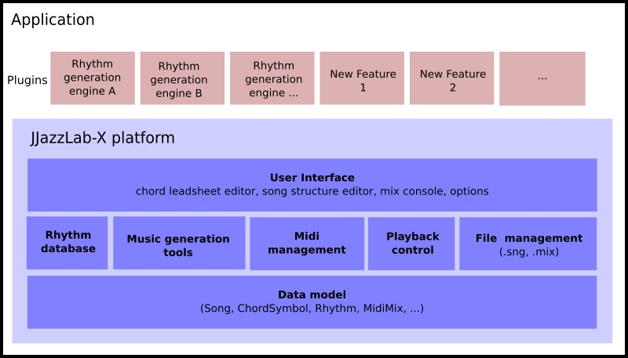

# JJazzLab-X

**Links**   [User Guide](https://jjazzlab.gitbook.io/user-guide)  -  [JJazzLab-X GitHub repository](https://github.com/jjazzboss/JJazzLab-X)  -  [www.jjazzlab.com](https://www.jjazzlab.com)

JJazzLab-X is a Midi-based framework dedicated to backing tracks generation. 

The ultimate objective is to develop a jam buddy able to quickly generate intelligent and interesting backing tracks: realistic and non-boring backing tracks which you can easily adjust to specific songs.

## Architecture


JJazzLab-X has a rather well-commented source code: don't hesitate to browse the [GitHub repository](https://github.com/jjazzboss/JJazzLab-X) or the [javadoc API](https://www.jjazzlab.com/javadoc/index.html).


## Develop your own rhythm generation engine without hassle

Thanks to JJazzLab-X developers can save a huge amount of work by only focusing on their music generation engine. Out of the box, the JJazzLab-X framework provides all the infrastructure, all the “plumbing” that, before, every developer had to write themselves.

JJazzLab-X can host any number of music generation engines as plugins. What happens when you load a song file and press the Play button?

1. The framework shows the song in the editors
2. The framework sends Midi messages to initialize the connected Midi sound device
3. When user press Play, the framework sends the song data to the music generation engine
4. The music engine uses the song data to generate the Midi data for the backing tracks
5. The framework retrieves the Midi data and plays it

## Easily add new features

JJazzLab-X is based on the [Apache Netbeans Platform](https://netbeans.apache.org/). It provides a reliable and extensible application architecture.

The Netbeans Platform turns JJazzLab-X into a pluggable application where plugins can be installed or deactivated at runtime. Plugins can easily add/alter features and insert UI elements such as menu items.

For example suppose that you work on reharmonization algorithms \(e.g. replace \| A7 \| D7M \| by \| Em7 A7 \| D7M\). It's easy to add a feature which propose possible reharmonizations when user selects multiple chord symbols. You'll just create a new action class which implements the algorithm on the current chord symbols selection, and "connect" \(via annotations, no code required\) this action to a new menu item in the Chord Symbol popup menu.

