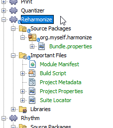
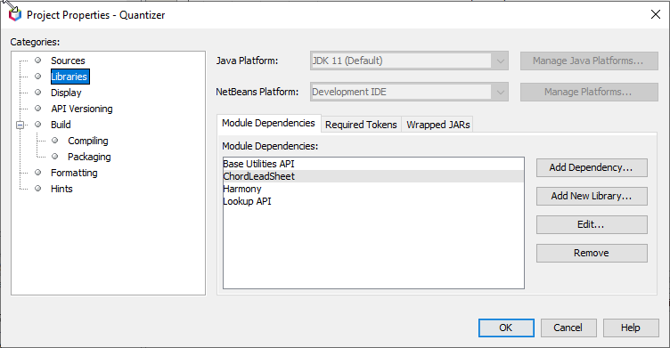
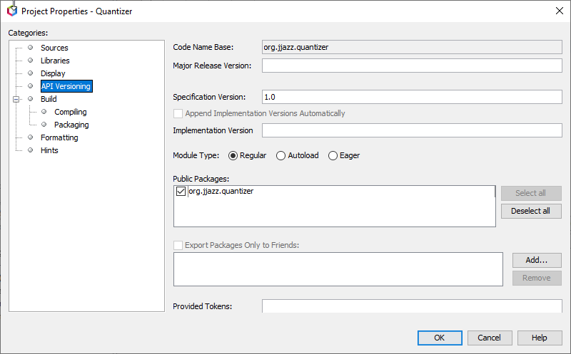
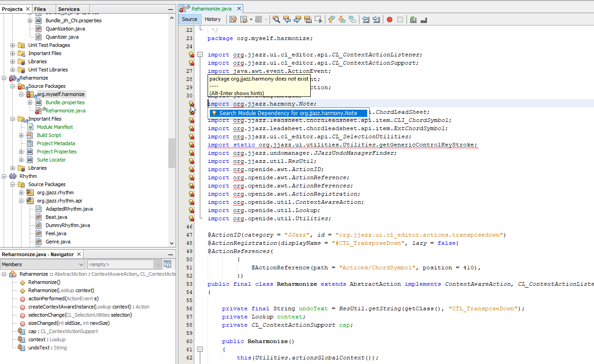
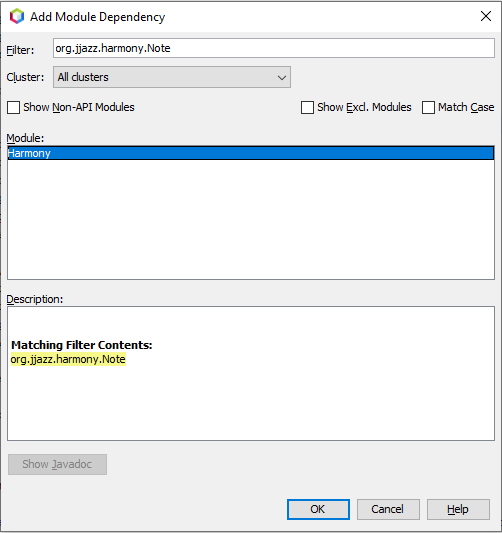
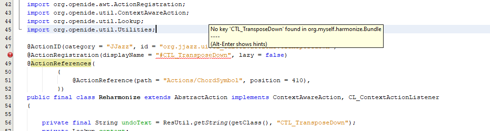
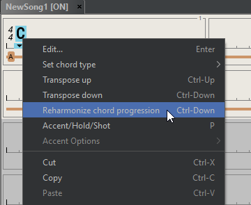

# Getting started

JJazzLab-X is based on the [Apache Netbeans Platform](https://netbeans.apache.org/kb/docs/platform.html) \(formerly Netbeans RCP for Rich Client Platform\). It provides a reliable and extensible architecture for desktop application which manages the application life cycle, the window system, extension points, options, actions, extension points, etc.

Each distinct feature in a Netbeans Platform application can be provided by a distinct Netbeans module, which is comparable to a plugin. A Netbeans module is a group of Java classes that provides an application with a specific feature.Most of the directories you see in the [JJazzLab-X root directory on GitHub](https://github.com/jjazzboss/JJazzLab-X) are the JJazzLab-X modules.

So unless you want to fix the JJazzLab-X code itself, you will probably start by creating your own Netbeans module. We'll show below how to plug your new feature in the application, e.g. how to make a new action appear in a give menu, or how to make your new rhythm engine appear in the rhythm selection dialog.


You need to have previously built [JJazzLab-X from source code](build-from-source-code.md) using Netbeans IDE.


## Create your Netbeans module


In this example we want to add a new action which proposes re-harmonized chord progressions in the chord symbol popup menu.


Let's first create a new module to hold our code.

In the Netbeans IDE, select JJazzLab-X/modules then **Add New...** in the popup menu.

1. In the Netbeans IDE, select JJazzLab-X/modules then **Add New...** in the popup menu
2. Enter any name, e.g. "Reharmonize"
3. Specify any code name base \(java package name\), e.g. "org.myself.reharmonize"

You new module will appear in the JJazzLab-X modules list. Open it. You should have something like this:



The **Important Files** folder contain the module configuration files, which usually you don't have to modify manually \(this is done automatically by the IDE, typically using the module Properties dialog\). 

#### Adjust module properties

Select the Reharmonize module then **Properties** in the popup menu. The important settings are:

* **Source level**: must be set to 11 \(enable Java 11 language features\)
* **Libraries** : dependencies on other modules \(JJazzLab-X modules or Netbeans application framework modules\), plus possibly dependencies on external libraries used by your module
* **API versioning**: this is where you declare the public packages of your module, i.e. the packages visible by other modules when they add your module as a dependency

**Example** : below are the properties of the JJazzLab-X **Quantizer** module:



As you see above, the Quantizer module has dependencies on 2 JJazzLab-X modules \(ChordLeadSheet and Harmony\). The others are Netbeans application framework modules.



The Quantizer module has only a single API package, which is made public to other modules.

## Add code

### Start from existing code

We want to create a "Reharmonize" action in the chord symbol popup menu. The best way is to look for a similar action and copy the code. Actions classes are mainly found in the following modules:

* [CL\_Editor ****](https://github.com/jjazzboss/JJazzLab-X/tree/master/CL_Editor/src/org/jjazz/ui/cl_editor)module : Chord Leadsheet editor actions such as insert bar, transpose chord symbols, etc.
* [SS\_Editor ](https://github.com/jjazzboss/JJazzLab-X/tree/master/SS_Editor/src/org/jjazz/ui/ss_editor)module : Song Structure editor actions such as delete song part, change rhythm, etc.
* [MixConsole ](https://github.com/jjazzboss/JJazzLab-X/tree/master/MixConsole/src/org/jjazz/ui/mixconsole)module : save default rhythm mix, mute all, etc.
* [MusicControlActions ](https://github.com/jjazzboss/JJazzLab-X/tree/master/MusicControlActions/src/org/jjazz/ui/musiccontrolactions)module: play, stop, etc. 
* [SongEditorManager ](https://github.com/jjazzboss/JJazzLab-X/tree/master/SongEditorManager/src/org/jjazz/songeditormanager)module: new song, open song, duplicate song, etc.

The chord leadsheet editor [**TransposeDown** ](https://github.com/jjazzboss/JJazzLab-X/blob/master/CL_Editor/src/org/jjazz/ui/cl_editor/actions/TransposeDown.java)action appears in the popup menu when chord symbols are selected, so it's a good candidate. 

In the Netbeans IDE:

1. Open the **CL\_Editor** module, find, select and copy **TransposeDown.java**. 
2. Open the **Reharmonize** module, select the **org.myself.reharmonize** package, and choose **Paste** \(refactor copy\)
3. A dialog appears, set the new name to **Reharmonize.java** and press Refactor, the file is created.

**Reharmonize.java** has many errors: this is due to the missing module dependencies. You could manually update the module properties as explained above, but there is an easier way, directly from the editor, as shown below.



Roll the mouse over the light bulb on the left margin, and click on the popup **Seach Module Dependency for org.xxx**.  This brings the **Add Module Dependency** with the Filter field initialized with the dependency to be searched. Wait a few seconds and the relevant dependency should appear: select it and press OK.



Repeat the same operation until all dependencies are fixed. 

### Update the code

#### Action annotations

Now you should have only one error in the file:



Netbeans uses annotations to facilitate action declaration: 

* In the **@ActionID** declaration, replace the **id** string by a string of your choice, e.g **org.myself.reharmonize**

The action displayName is **\#CTL\_TransposeDown**, and the leading \# means the string value is searched in the localization **Bundle.properties** localization file in the same package \(so it can be easily internationalized\). As we copied only the .java file, the string definition is missing in our **Bundle.properties** file. 

1. Change all the **CTL\_TransposeDown** strings to **CTL\_Reharmonize** in **Reharmonize.java**
2. Edit **Bundle.properties** and add a line with **CTL\_Reharmonize=Reharmonize chord progression**

The **@ActionReference** puts a reference to this action in the Netbeans virtual file system, in the **Actions/ChordSymbol** directory. When user shows the chord symbol popup menu, JJazzLab-X takes all action references found in this directory and create the related menu entries, using the **position** value to order them.

1. In **@ActionReference** change position value to **415**, so our action will appear in the popup menu after the TransposeDown action.

Now the module should be compilable. Select the **Reharmonize** module then **Build** from the popup menu.

Run JJazzLab-X, then in a song select a chord symbol and show the popup menu: our action should be there, as shown below. If you select it it will transpose down the chords symbols, as we have not yet changed the action code itself.



#### Action code

The 2 most important methods are:

* **selectionChange**\(\), which is called each time selection has changed \(select/unselect bars, chord symbols, sections\) in the current chord lead sheet editor. This is used to enable/disable the action depending on the selection.
* **actionPerformed\(\)**, which performs the action on the current selection.

The automatic selection change mechanism is provided by the **CL\_ContextActionSupport** helper class.  This mechanism is based on the powerful **Netbeans global Lookup** mechanism, which is a out of scope of this simple tutorial -but you will easily find explanations on the web. 

Below is a sketch of a possible Reharmonize action implementation.

```text
 @Override
    public void actionPerformed(ActionEvent e)
    {
        // Get current selection state
        CL_SelectionUtilities selection = cap.getSelection();


        // REHARMONIZE CODE HERE
                
        // 1. Get current selected chord symbols : selection.getSelectedChordSymbols()
        // List is guaranteed to be non empty because of our selectionChange() implementation

        // 2. Analyze current progression
        
        // 3. Find possible substitute progressions
        
        // 4. Show user a dialog to pick/listen to candidates                
        

        // Prepare the undoable action to receive the individual undoable edits
        ChordLeadSheet cls = selection.getChordLeadSheet();
        JJazzUndoManagerFinder.getDefault().get(cls).startCEdit(undoText);
                
        
        // 5. Edit the chord lead sheet accordingly (add/remove/change chord symbol items)
        // ChordLeadSheet instance is accessible via selection.getChordLeadSheet()

                
        // END OF REHARMONIZE CODE         


        // End the undoable action
        JJazzUndoManagerFinder.getDefault().get(cls).endCEdit(undoText);
    }
```


